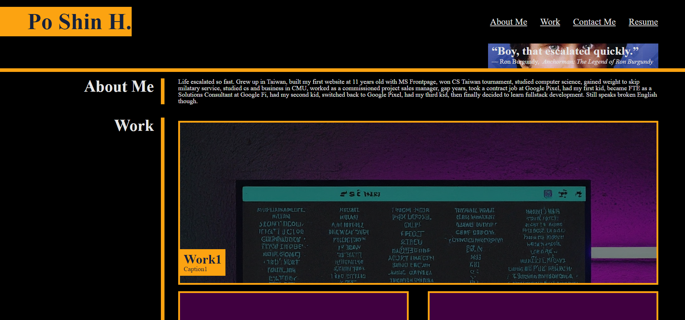
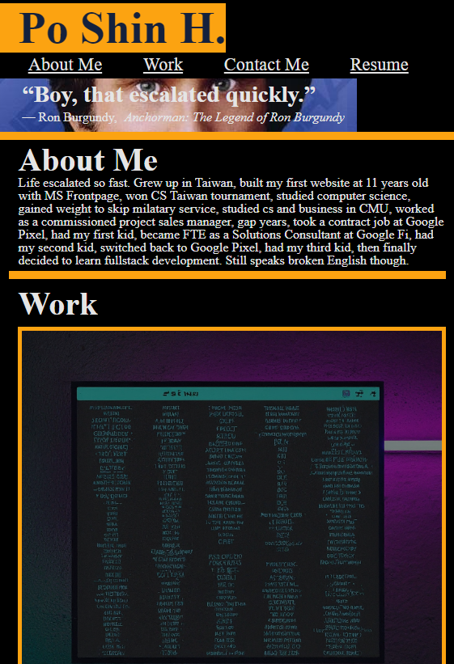

# psh-portfolio-starter
First time building a portfolio after 25+ years learning computer stuff.  Finally learning html, CSS and front end stuff.  Let's see how far can it go.

## Project Title: 
Po Shin Huang Portfolio

## Description:
Per UCB edX Fullstack bootcamp module 2, this is a portfolio starter to house my work.  So far the key is to leverage CSS so the page looks good.

## Installation:
N/A 

## Usage:
open https://momokokong.github.io/psh-portfolio-starter/ directly from a browser.  It has layouts for desktop/mobile(<768px width>).

## Screenshot:

## Contributing:
Let me know if there any tips to improve the page

## License: 
MIT 

## Contact:
[LinkedIn](https://www.linkedin.com/in/poshinhuang/)
